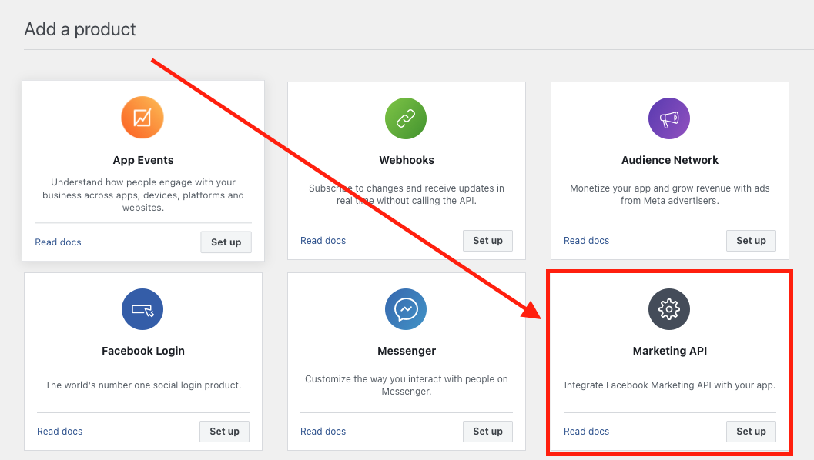
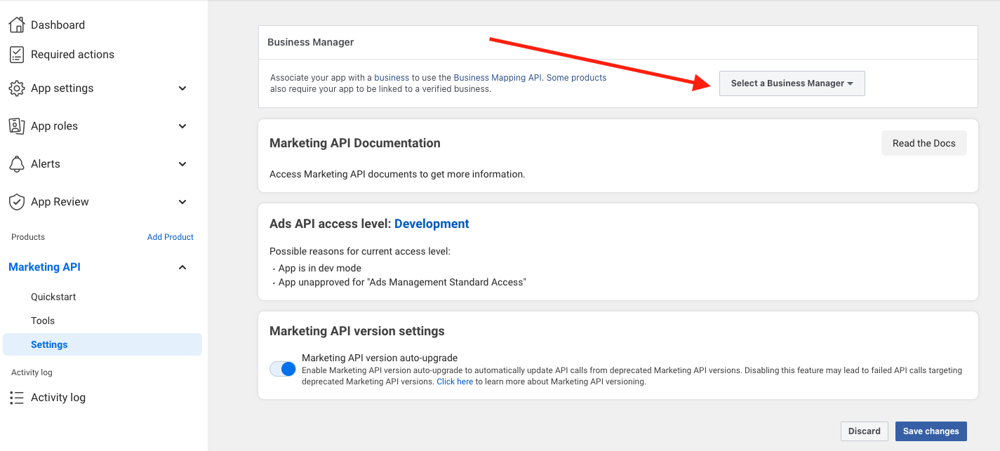
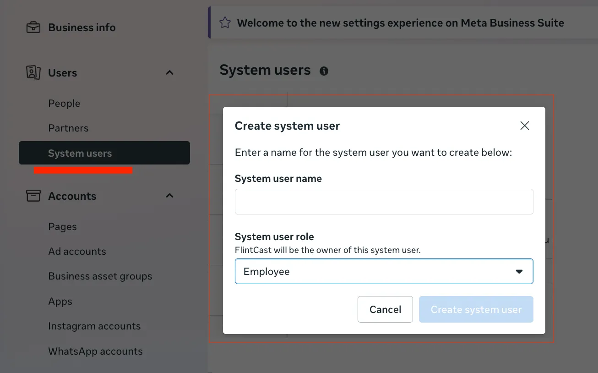
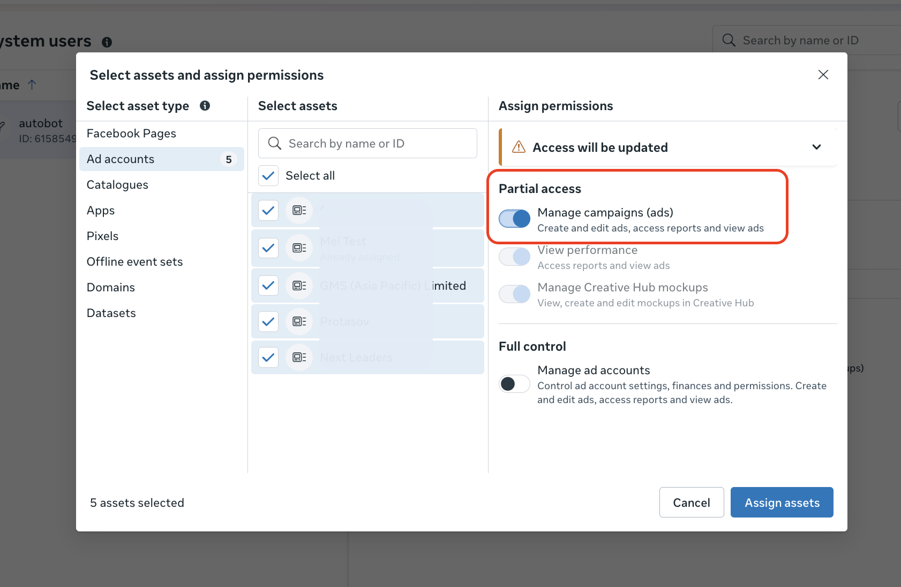
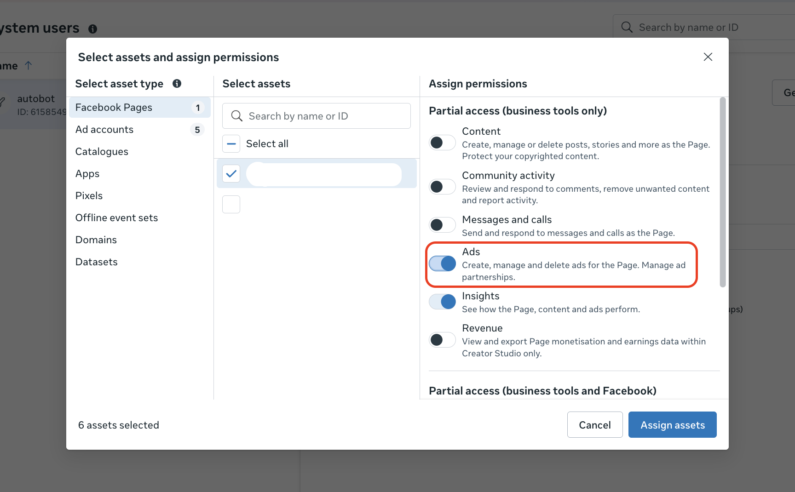
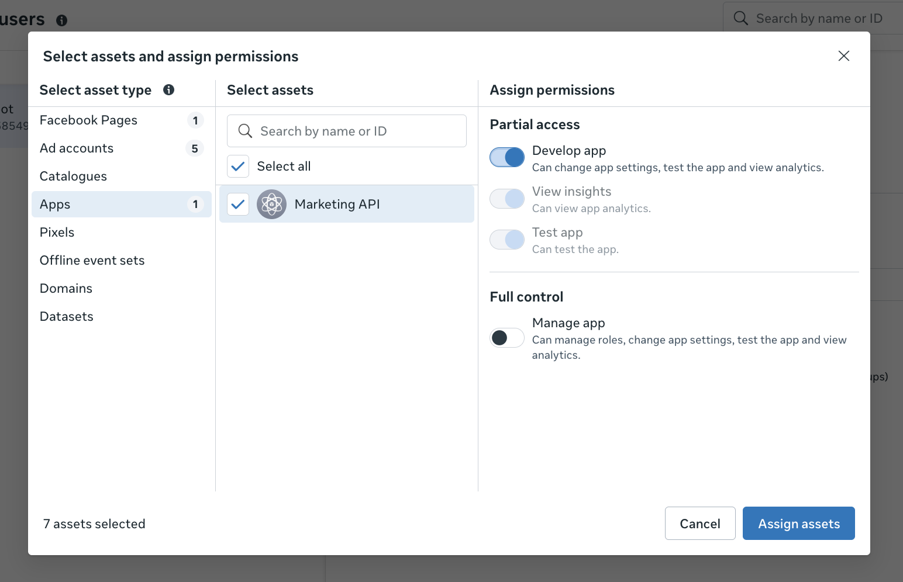
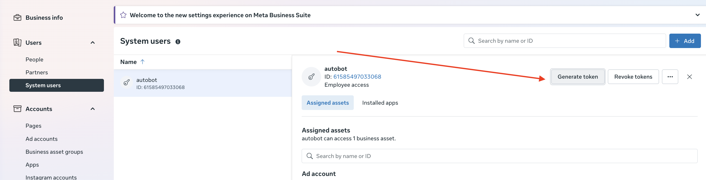
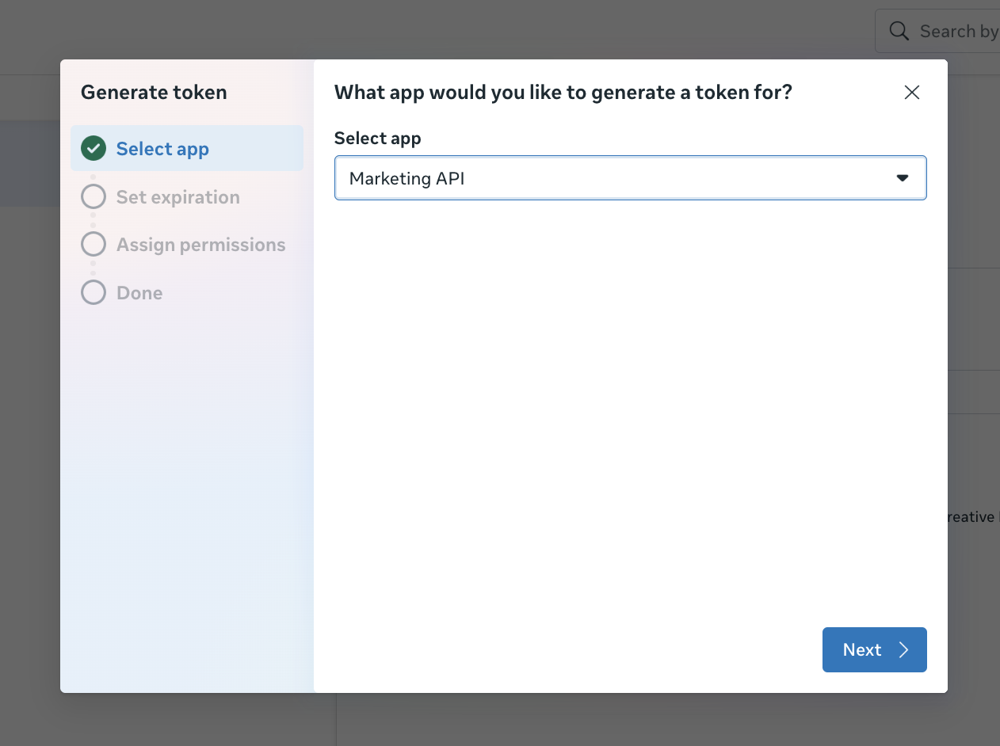
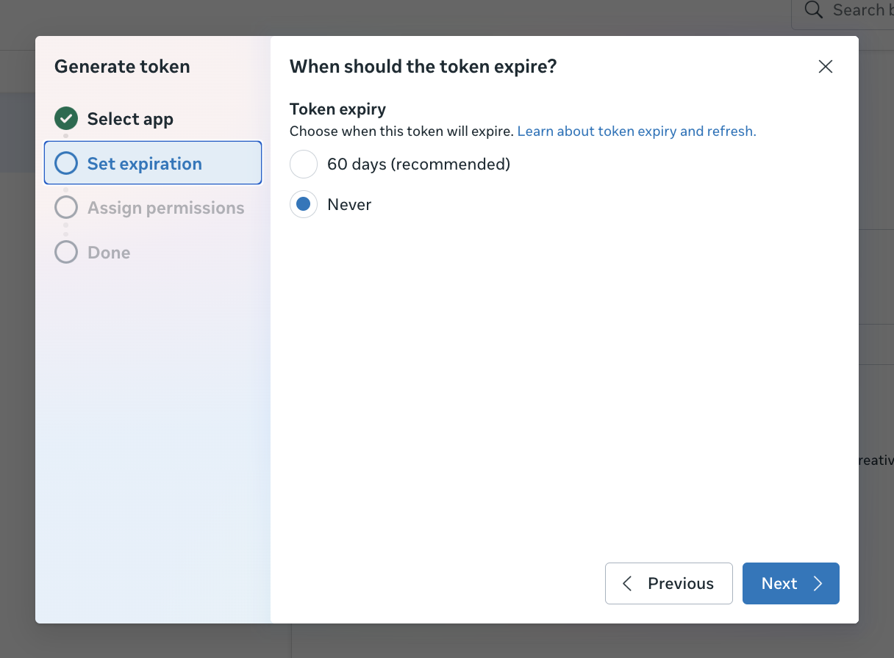
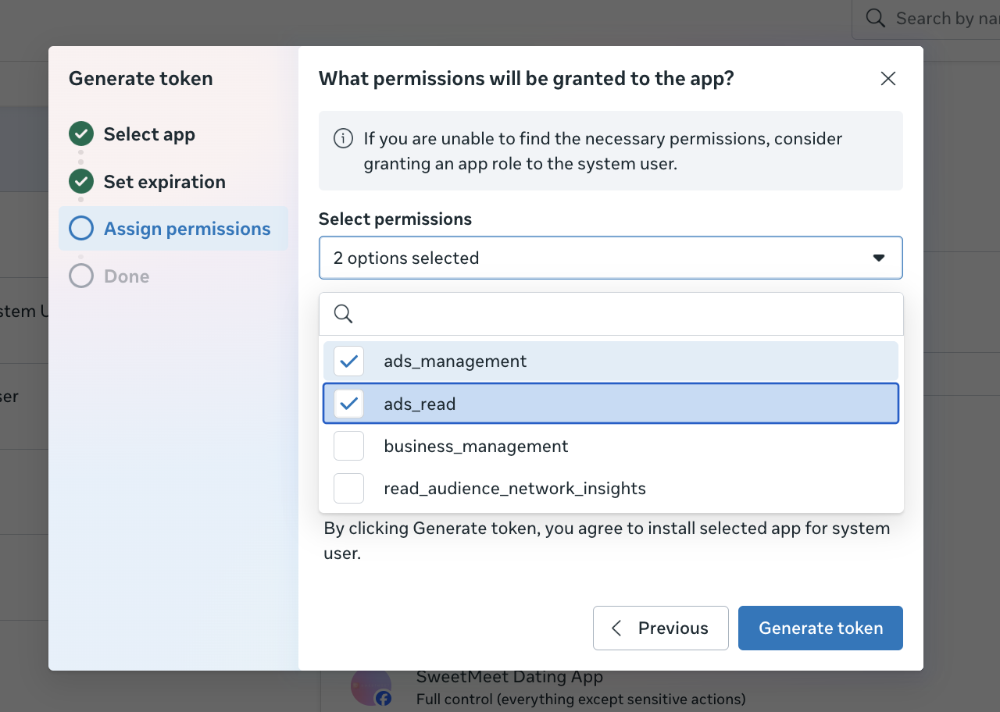

# Meta Marketing API Setup (System User Token)

This guide explains how to set up **Meta Marketing API** access for **one Business Manager**, **one Facebook Page**, and **multiple Ad Accounts** using a **System User** access token (recommended for automation), instead of a personal user token.

---

## What you will achieve

- A Meta app with **Marketing API** added/enabled
- A **System User** in Business Manager
- System User has access to the required **Ad Accounts** and **Page**
- A **System User access token** with the right permissions for API calls

---

## Prerequisites

- You have **Business Admin** access to the Business Manager.
- Your **Ad Accounts** and **Page** are owned by (or shared with) this Business Manager.
- Your app already exists in `developers.facebook.com` and is added to your Business Manager (if not, you will do that below).

---

## 1) Enable / Add Marketing API to your App (Meta for Developers)

1. Go to `developers.facebook.com`
2. Open **My Apps** → select your **App**
3. In the left menu, open **Add products**
4. Find **Marketing API** and click **Set up** / **Add**
5. Go to **App Settings** → **Basic**
   - Note **App ID** (you’ll need it later)
   - (Optional) Confirm **App Secret** is available (don’t put it into screenshots)
   - Add **Privacy Policy URL** and **Terms of Service URL** (recommended; often required for production/review)
6. Go to **App Settings** → **Advanced**
   - (Optional) Set **App Domains** if you use web-based OAuth/redirects
   - (Optional) Add **Valid OAuth Redirect URIs** if you plan to run OAuth later

---

## 2) Associate the App with the correct Business Manager (Marketing API Settings)

Meta requires your app to be associated with a Business Manager for some Business-related API use cases.

1. In your app dashboard (`developers.facebook.com`), open **Marketing API** → **Settings**
2. In the **Business Manager** section, click **Select a Business Manager**
3. Choose the Business Manager that owns (or has access to) your ad accounts and page
4. Save changes

---

## 3) Add the App to your Business Manager (Business Settings)

If your app is already in the Business Manager, you can just verify it appears in the list.

1. Open Business Settings: `business.facebook.com/settings`
2. Go to **Accounts** → **Apps** (menu names vary by UI locale/version)
3. Verify your app appears in the list

> Screenshot: Business Settings → Apps list with your app visible

---

## 4) Create a System User (Business Settings)

1. In **Business Settings**, go to **Users** → **System Users**
2. Click **Add**
3. Choose a type:
   - **Admin System User** (easiest for initial setup; you can reduce permissions later), or
   - **Employee System User** (more restrictive)
4. Name it clearly, for example:
   - `marketing-api-bot`
   - `campaign-generator-system-user`
5. Save

---

## 5) Assign Assets (Ad Accounts + Page + App) to the System User

### 5.1 Assign Ad Accounts

1. In **Business Settings** → **Users** → **System Users**
2. Select your System User
3. Click **Add Assets** / **Assign Assets**
4. Choose **Ad Accounts**
5. Select all Ad Accounts you want this System User to manage
6. Grant permissions sufficient for your workflow (wording varies):
   - Typically **Manage ad account** (needed for create/update campaigns/ad sets/ads)
7. Save

### 5.2 Assign the Facebook Page

1. Still on the System User, click **Add Assets** / **Assign Assets**
2. Choose **Pages**
3. Select your Facebook Page
4. Grant the required Page permissions:
   - Typically **Full control** / **Manage Page** (wording varies)
5. Save

### 5.3 Assign the App (recommended)

To avoid permission issues, assign the app itself to the System User.

1. Still on the System User, click **Add Assets** / **Assign Assets**
2. Choose **Apps**
3. Select your app
4. Grant the required permissions (usually **Manage** / **Full control**, wording varies)
5. Save

> Note: If your ad creation flow uses Instagram identity, also assign the **Instagram account** under Business Settings → Accounts → Instagram accounts (if applicable).

---

## 6) Generate a System User Access Token

1. In **Business Settings** → **Users** → **System Users**
2. Select your System User
3. Find the **Access Tokens** section
4. Click **Generate New Token**
   
   

5. Select your **App**

   

6. Set **Token expiry** to **Never**

   

7. Select the assets (Ad Accounts / Page) when prompted
8. Select permissions (scopes) for the token. Common choices:
   - `ads_management` (create/update campaigns, ad sets, ads)
   - `ads_read` (read/reporting)
   
   

9. Click **Generate Token**
10. Copy the token and store it securely (password manager / secrets manager)

> Note: Add `business_management` only if you truly need Business Manager–level operations.

---

## 7) Validate the Token (recommended)

Use Graph API Explorer:

1. Open `developers.facebook.com/tools/explorer/`
2. Paste the System User token (or select it if available)
3. Run:
   - `GET /me?fields=id,name`
4. (Optional) Check accessible ad accounts:
   - `GET /me/adaccounts`

If `/me/adaccounts` returns the expected ad accounts, the setup is correct.

**Screenshot placeholder**: Graph API Explorer request + successful response
